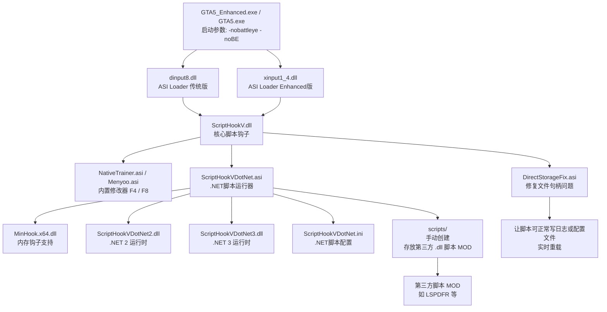
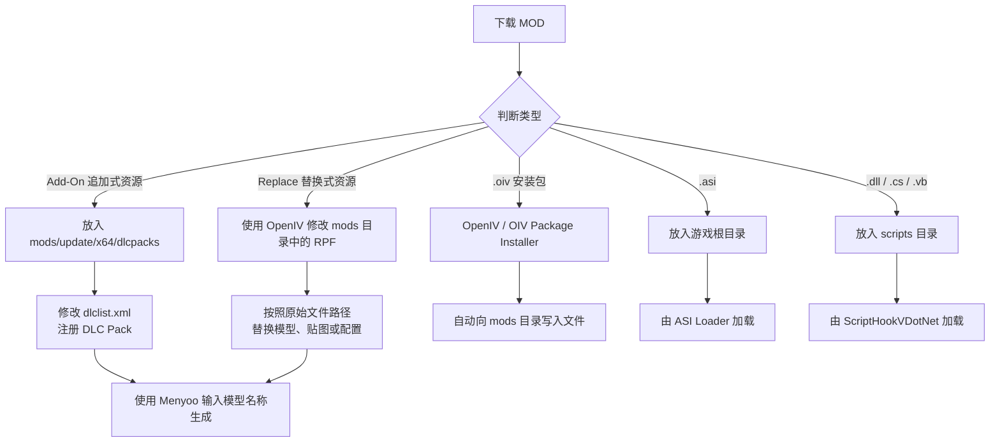
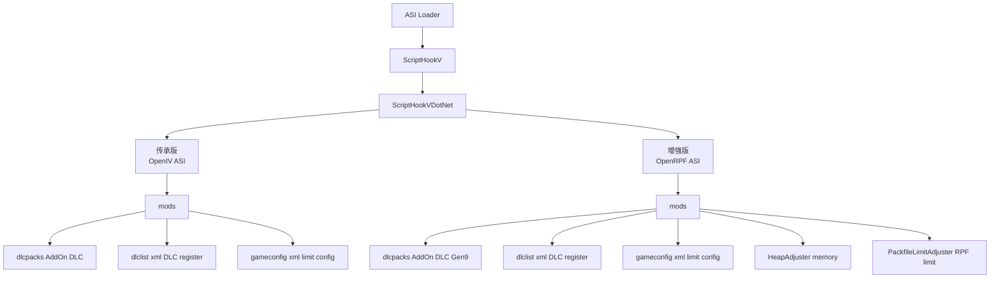

\!\[20260404231851_1](assets/20260404231851_1-20260405000946-txvwdc0.jpg)

2013 年初次看到这个画面及丰富游戏性给我带来的震撼感

## 修改器（仅故事模式）




安装 NativeTrainer，核心是 3 个文件：`dinput8.dll`、`ScriptHookV.dll`、`NativeTrainer.asi`

1. 到 http://www.dev-c.com/gtav/scripthookv/ 获取 `ScriptHookV.zip` 文件，里边包含 `ScriptHookV.dll`、`dinput8.dll` 等文件：

    ```ini
    PS E:\download\ScriptHookV_3788.0_1013.33> tree
    .
    |-- [ 940]  HOW_TO_INSTALL_2026.txt
    |-- [   0]  bin
    |   |-- [212K]  NativeTrainer.asi
    |   |-- [1.9M]  ScriptHookV.dll
    |   |-- [  17]  args.txt
    |   |-- [128K]  dinput8.dll
    |   `-- [131K]  xinput1_4.dll
    |-- [8.5K]  readme.txt
    `-- [  42]  www.dev-c.com.url
    ```
2. （.net 脚本增强，可选）到 https://www.gta5-mods.com/tools/script-hook-v-net-enhanced 获取 `ScriptHookVDotNet.zip` 文件：

    ```ini
    PS E:\download\471f38-ScriptHookVDotNetEnhanced-v1.1.0.4> tree
    .
    |-- [   0]  Debug
    |   |-- [1.4M]  ScriptHookVDotNet.pdb
    |   |-- [1.4M]  ScriptHookVDotNet2.pdb
    |   `-- [2.1M]  ScriptHookVDotNet3.pdb
    |-- [   0]  Docs
    |   |-- [882K]  ScriptHookVDotNet2.xml
    |   `-- [2.6M]  ScriptHookVDotNet3.xml
    |-- [   0]  Licenses
    |   |-- [3.3K]  COPYRIGHT.md
    |   |-- [1.1K]  CallHookLicense.txt
    |   |-- [ 930]  LICENSE.txt
    |   |-- [4.3K]  MinHookLicense.txt
    |   `-- [2.5K]  THIRD-PARTY-NOTICES.md
    |-- [ 16K]  MinHook.x64.dll
    |-- [ 192]  README.txt
    |-- [287K]  ScriptHookVDotNet.asi
    |-- [1.9K]  ScriptHookVDotNet.ini
    |-- [960K]  ScriptHookVDotNet2.dll
    `-- [1.4M]  ScriptHookVDotNet3.dll
    ```

    建议修改 `ScriptHookVDotNet.ini` 中的 `ConsoleKeyBinding` 项，不然会和 `NativeTrainer` 的 F4 冲突，导致界面覆盖
3. 到 https://www.gta5-mods.com/scripts/directstoragefix 下载 `DirectStorageFix.zip`：

    ```ini
    PS E:\download\58cd7d-DirectStorageFix> tree
    .
    |-- [579K]  DirectStorageFix.asi
    `-- [ 968]  ReadMe.txt
    ```

    当启用 DirectStorage（Win11 + NVMe SSD）时，游戏会为目录下每个文件打开句柄，导致脚本无法写入日志/配置/数据文件，或实时重载脚本。此补丁限制只打开 .rpf 和 .cache 文件，恢复脚本写入和重载功能
4. （仅支持传承版 gta5）加强版 NativeTrainer，https://www.gta5-mods.com/scripts/enhanced-native-trainer-zemanez-and-others，相较于原版 nt 有更多功能，还可以刷出线上模式的载具

    ```ini
    PS E:\download\dbd651-Enhanced Native Trainer Update 57.1> tree
    .
    |-- [   0]  Enhanced Native Trainer
    |   |-- [4.6M]  ENT_vehicle_previews.ytd
    |   |-- [ 14K]  ent-config.xml
    |   `-- [1.5K]  ent_customization.ini
    `-- [ 12M]  EnhancedNativeTrainer.asi
    ```
5. （支持增强版 gta5）使用 Menyoo 2.0，https://www.gta5-mods.com/scripts/menyoo-2-0，直接放在 GTA5_Enhanced.exe 同目录；遇到乱码的问题，推荐使用第三方制作的汉化版本：https://mod.3dmgame.com/mod/198327

    ```ini
    PS E:\download\bfd9fd-MenyooSP> tree -L 2
    .
    |-- [ 711]  License.txt
    |-- [3.2M]  Menyoo.asi
    |-- [1.9K]  Readme.txt
    |-- [   0]  menyooStuff
    |   |-- [ 595]  AnimalRidingData.xml
    |   |-- [   0]  Audio
    |   |-- [ 11K]  CutsceneLabels.txt
    |   |-- [   0]  Graphics
    |   |-- [2.3M]  JumpAroundMode.mp3
    |   |-- [   0]  Language
    |   |-- [   0]  Outfit
    |   |-- [ 11M]  PedAnimList.txt
    |   |-- [345K]  PedDecalOverlays.xml
    |   |-- [ 61K]  PedList.xml
    |   |-- [4.9M]  PedSpeechList.txt
    |   |-- [448K]  PropList.txt
    |   |-- [   0]  Spooner
    |   |-- [ 46K]  TimecycModifiers.xml
    |   |-- [   0]  Vehicle
    |   |-- [   0]  WeaponsLoadout
    |   `-- [6.4K]  menyooConfig.ini
    `-- [1016]  menyoolog.txt
    ```

最终需要以下文件：

```ini
PS E:\download\gta5> tree -L 1
.
|-- [579K]  DirectStorageFix.asi
|-- [3.2M]  Menyoo.asi	// 增强版修改器 F8
|-- [ 16K]  MinHook.x64.dll
|-- [212K]  NativeTrainer.asi
|-- [1.9M]  ScriptHookV.dll
|-- [287K]  ScriptHookVDotNet.asi
|-- [1.9K]  ScriptHookVDotNet.ini
|-- [960K]  ScriptHookVDotNet2.dll
|-- [1.4M]  ScriptHookVDotNet3.dll
|-- [  17]  args.txt
|-- [128K]  dinput8.dll
|-- [   0]  menyooStuff
|-- [   0]  scripts	// 手动创建该文件夹
`-- [131K]  xinput1_4.dll

2 directories, 12 files
```

将他们放到 GTA5_Enhanced.exe / GTA5.exe 同目录下，并在游戏启动项里，添加 `-nobattleye -noBE` 命令

启动游戏，按 F4 打开命令面板

## MOD（仅故事模式）

GTA5 MOD 大致分为以下几类：



其中，装在流程的区别如下



最终目录如下

> 传承版 GTA5（Legacy / Gen8）

```bash
Grand Theft Auto V
.
├── GTA5.exe
├── dinput8.dll                  # ASI Loader（核心入口）
├── ScriptHookV.dll
├── ScriptHookVDotNet.asi
├── ScriptHookVDotNet.ini
├── ScriptHookVDotNet2.dll
├── ScriptHookVDotNet3.dll
├── NativeTrainer.asi
├── Menyoo.asi
├── DirectStorageFix.asi
├── MinHook.x64.dll
├── xinput1_4.dll
│
├── OpenIV.asi                   # 关键：加载 mods 目录
│
├── scripts/                     # .NET / C# / VB 脚本
│   ├── Example.dll
│   ├── Example.ini
│   └── data/
│
├── menyooStuff/
│   └── ...
│
├── mods/                        # 所有 MOD 主目录（核心）
│   ├── update/
│   │   ├── update.rpf
│   │   │   └── common/data/
│   │   │       ├── dlclist.xml
│   │   │       └── gameconfig.xml   # 资源限制核心
│   │   │
│   │   └── x64/
│   │       └── dlcpacks/
│   │           ├── su7/
│   │           │   └── dlc.rpf      # Add-On 载具
│   │           ├── policepack/
│   │           │   └── dlc.rpf
│   │           └── map_mod/
│   │               └── dlc.rpf
│   │
│   ├── x64e.rpf                  # Replace（替换类资源）
│   ├── x64w.rpf
│   └── ...
│
├── HeapAdjuster.asi             # 内存堆扩展
├── HeapAdjuster.ini
│
├── PackfileLimitAdjuster.asi    # RPF 数量限制扩展
├── PackfileLimitAdjuster.ini
│
├── args.txt
│
└── logs/
    ├── ScriptHookV.log
    ├── ScriptHookVDotNet.log
    └── asiloader.log
```

> 增强版 GTA5（Enhanced / Gen9）

```bash
Grand Theft Auto V Enhanced
.
├── GTA5_Enhanced.exe
├── dinput8.dll
├── ScriptHookV.dll
├── ScriptHookVDotNet.asi
├── ScriptHookVDotNet.ini
├── ScriptHookVDotNet2.dll
├── ScriptHookVDotNet3.dll
├── NativeTrainer.asi
├── Menyoo.asi
├── DirectStorageFix.asi
├── MinHook.x64.dll
├── xinput1_4.dll
│
├── OpenRPF.asi                  # 替代 OpenIV.asi（关键差异）
│
├── scripts/
│   ├── *.dll
│   ├── *.cs
│   └── config/
│
├── menyooStuff/
│
├── mods/                        # 结构相同，但内容兼容 Gen9
│   ├── update/
│   │   ├── update.rpf
│   │   │   └── common/data/
│   │   │       ├── dlclist.xml
│   │   │       ├── gameconfig.xml   # 必须是 Enhanced 版本
│   │   │       └── handling.meta
│   │   │
│   │   └── x64/
│   │       └── dlcpacks/
│   │           ├── su7/
│   │           │   └── dlc.rpf      # 必须 Gen9 资源
│   │           ├── su7_fix_hand/
│   │           │   └── dlc.rpf
│   │           └── map_pack/
│   │               └── dlc.rpf
│   │
│   ├── x64a.rpf
│   ├── x64b.rpf
│   └── ...
│
├── HeapAdjusterEnhanced.asi
├── HeapAdjusterEnhanced.ini
│
├── PackfileLimitAdjusterEnhanced.asi
├── PackfileLimitAdjusterEnhanced.ini
│
└── logs/
	├── ScriptHookV.log
	├── ScriptHookVDotNet.log
	├── OpenRPF.log
	└── heap.log
```

### 准备 `mods` 目录

脚本类 MOD 可以直接由 ScriptHookV 加载，但载具、地图、贴图、武器等资源类 MOD 通常需要修改游戏的 RPF 文件。不建议直接修改游戏原始文件，应当使用 `mods` 目录保存修改后的副本：

```ini
GTA5_Enhanced.exe / GTA5.exe
|-- mods
|   `-- update
|       |-- update.rpf
|       `-- x64
|           `-- dlcpacks
|-- scripts
|-- ScriptHookV.dll
`-- ...
```

1. 到 [https://openiv.com/](https://openiv.com/) 下载并安装 OpenIV，用于浏览和编辑 `.rpf` 文件；
2. 在 OpenIV 中选择 GTA V，并定位到游戏安装目录（增强版需要额外下载 [https://www.gta5-mods.com/tools/openiv-fix-for-gta-5-enhanced](https://www.gta5-mods.com/tools/openiv-fix-for-gta-5-enhanced) 用批处理脚本手动设置游戏安装目录）
3. 打开右上角的 `Edit mode`
4. 在左侧资源栏里打开 `update\update.rpf`，选择 `Copy to "mods" folder`，将其复制为：

    ```ini
    mods\update\update.rpf
    ```
5. 在 `mods\update` 目录下手动创建追加式 DLC Pack 使用的目录：

    ```ini
    mods\update\x64\dlcpacks
    ```

OpenIV 主要负责编辑 RPF 文件。游戏运行时是否会读取 `mods` 目录，还需要对应版本的加载器。

#### GTA5 传承版

打开 OpenIV：

```ini
Tools
`-- ASI Manager
    |-- ASI Loader
    `-- OpenIV.asi
```

安装 `ASI Loader` 和 `OpenIV.asi`，游戏便会优先加载 `mods` 目录中的文件。

#### GTA5 增强版

* 增强版不能使用原始 `OpenIV.asi`，需要安装 OpenRPF：[https://www.gta5-mods.com/tools/openrpf-openiv-asi-for-gta-v-enhanced](https://www.gta5-mods.com/tools/openrpf-openiv-asi-for-gta-v-enhanced)，将压缩包中的文件放入 `GTA5_Enhanced.exe` 同目录，并创建 `mods` 文件夹

* 如果 OpenIV 无法识别 `GTA5_Enhanced.exe`，可以安装：[https://www.gta5-mods.com/tools/openiv-fix-for-gta-5-enhanced](https://www.gta5-mods.com/tools/openiv-fix-for-gta-5-enhanced)，此补丁只负责让 OpenIV 正确识别增强版目录。运行游戏时加载 `mods` 目录的仍然是 `OpenRPF.asi`

* 不要在增强版的 OpenIV ASI Manager 中安装原始 `OpenIV.asi`。

* 增强版使用 Gen9 格式资源。传承版使用的 Gen8 模型、贴图或 RPF 文件不能直接放入增强版，否则可能在启动、生成载具或载入地图时崩溃。

下载 MOD 时需要确认存在以下标识之一：

```ini
Enhanced
Gen9
GTA5_Enhanced
Legacy + Enhanced
```

### 安装脚本类 MOD

脚本类 MOD 一般会提供 `.asi`、`.dll`、`.cs` 或 `.vb` 文件。

#### ASI 脚本

`.asi` 文件直接放到游戏根目录：

```ini
GTA5_Enhanced.exe
|-- ExampleMod.asi
|-- ExampleMod.ini
|-- ScriptHookV.dll
`-- xinput1_4.dll
```

配置文件、资源目录应当按照 MOD 压缩包中的相对位置一同复制：

```ini
ExampleMod.asi
ExampleMod.ini
ExampleMod
|-- Audio
|-- Data
`-- Textures
```

不要只提取 `.asi` 文件而忽略配套目录。

#### .NET 脚本

`.dll`、`.cs`、`.vb` 等 ScriptHookVDotNet 脚本放入 `scripts` 目录：

```ini
scripts
|-- ExampleScript.dll
|-- ExampleScript.ini
`-- ExampleScript
    |-- config.json
    `-- data
```

部分 `.dll` 是脚本依赖库，而不是可以独立运行的 MOD。应当保持作者提供的目录结构，不要把所有 DLL 全部移动到游戏根目录。

安装后可以查看以下日志判断加载情况：

```ini
ScriptHookV.log
ScriptHookVDotNet.log
asiloader.log
OpenRPF.log
```

具体日志名称取决于所使用的加载器和 MOD。

### 安装 Add-On 追加式载具（优先选择）

Add-On 不会覆盖游戏原有载具，而是作为新的 DLC Pack 加入游戏，通常比 Replace 更容易管理。

以载具 MOD 的 DLC Pack 名称为 `xiaomi_su7` 为例。

1. 解压 MOD，找到直接包含 `dlc.rpf` 的文件夹：

    ```ini
    xiaomi_su7
    `-- dlc.rpf
    ```

    常见错误是多嵌套了一层目录：

    ```ini
    // 错误
    dlcpacks\xiaomi_su7\xiaomi_su7\dlc.rpf

    // 正确
    dlcpacks\xiaomi_su7\dlc.rpf
    ```
2. 将整个 DLC Pack 文件夹复制到：

    ```ini
    mods\update\x64\dlcpacks\xiaomi_su7
    ```

    最终结构：

    ```ini
    mods
    `-- update
        `-- x64
            `-- dlcpacks
                `-- xiaomi_su7
                    `-- dlc.rpf
    ```
3. 使用 OpenIV 打开（右键 `Edit`）：

    ```ini
    mods\update\update.rpf\common\data\dlclist.xml
    ```
4. 在 `&lt;/Paths&gt;` 前增加一行：

    ```xml
    &lt;Item&gt;dlcpacks:/xiaomi_su7/&lt;/Item&gt;
    ```

    例如：

    ```xml
    &lt;Paths&gt;
        &lt;Item&gt;platform:/dlcPacks/mpBeach/&lt;/Item&gt;
        &lt;Item&gt;platform:/dlcPacks/mpBusiness/&lt;/Item&gt;

        &lt;Item&gt;dlcpacks:/xiaomi_su7/&lt;/Item&gt;
    &lt;/Paths&gt;
    ```
5. 保存 `dlclist.xml`，启动游戏
6. 按 F8 打开 Menyoo，进入载具生成界面：

    ```ini
    Vehicle Options
    `-- Vehicle Spawner
        `-- Input Model
    ```
7. 输入 MOD 作者提供的 Spawn Name，例如：

    ```ini
    su7
    su7max
    xmsu7
    ```

DLC Pack 文件夹名称和载具生成名称不是同一个概念：

```ini
xiaomi_su7    // dlclist.xml 使用的 DLC Pack 名称
su7max        // Menyoo 中输入的模型名称
```

具体生成名称通常写在 MOD 的 `README.txt` 中，也可以打开 DLC Pack 内部的 `vehicles.meta`，查找：

```xml
<modelName>su7max</modelName>
```

### 安装 Replace 替换式载具

Replace 会覆盖游戏中的某个原始载具。例如将 `adder` 替换为其他超跑。

MOD 一般会提供以下文件：

```ini
adder.yft
adder_hi.yft
adder.ytd
```

安装步骤：

1. 查看 MOD 的 `README.txt`，确认作者给出的原始安装路径
2. 使用 OpenIV 打开对应 RPF 文件
3. 确认当前路径位于 `mods` 目录，而不是游戏原始目录
4. 开启 `Edit mode`
5. 将 `.yft`、`.ytd` 等文件拖入并覆盖
6. 启动游戏，生成被替换的原始载具

例如 MOD 要求替换：

```ini
x64e.rpf\levels\gta5\vehicles.rpf
```

实际应修改：

```ini
mods\x64e.rpf\levels\gta5\vehicles.rpf
```

如果 `mods` 目录中还没有对应的 RPF，先通过 OpenIV 将原始 RPF 复制到 `mods` 目录，再进行修改。

Replace 的优点是不需要编辑 `dlclist.xml`，缺点是会覆盖原始载具，并且多个 MOD 替换同一辆车时会发生冲突。

### 安装 OIV MOD 包

部分大型 MOD 会提供 `.oiv` 自动安装包。

#### 传承版

在 OpenIV 中选择：

```ini
Tools
`-- Package Installer
```

选择 `.oiv` 文件后，安装目标应优先选择：

```ini
Install to "mods" folder
```

不要选择直接写入游戏原始目录。

#### 增强版

增强版可以使用基于 CodeWalker 的 OIV Package Installer：

[https://www.gta5-mods.com/tools/oiv-package-installer](https://www.gta5-mods.com/tools/oiv-package-installer)

其支持传承版和增强版，并可以记录、管理和卸载已经安装的 OIV 包。

安装器支持增强版，不代表 OIV 包中的资源一定支持增强版。包含 Legacy 模型、Legacy `gameconfig.xml` 或旧版 RPF 的 OIV 包仍然可能导致增强版崩溃。

### 安装大量 Add-On MOD

只安装少量载具时，通常只需要正确配置 `dlclist.xml`。当 Add-On 载具、地图或 DLC Pack 数量增加后，可能遇到：

```ini
ERR_FIL_PACK_1
ERR_MEM_EMBEDDEDALLOC_ALLOC
启动时崩溃
进入故事模式时崩溃
无限加载
切换角色时崩溃
```

此时通常需要安装与当前游戏版本匹配的 `gameconfig.xml` 和限制调整器。

1. 下载支持当前版本的 Gameconfig：[https://www.gta5-mods.com/misc/gta-5-gameconfig-300-cars](https://www.gta5-mods.com/misc/gta-5-gameconfig-300-cars)
    根据游戏版本选择 `Legacy` 或 `Enhanced`，将 `gameconfig.xml` 放入：

    ```ini
    mods\update\update.rpf\common\data\gameconfig.xml
    ```
2. 下载 HeapAdjuster Enhanced：
    [https://www.gta5-mods.com/tools/heapadjuster-enhanced](https://www.gta5-mods.com/tools/heapadjuster-enhanced)
    将以下文件放入游戏根目录：

    ```ini
    HeapAdjuster.asi
    HeapAdjuster.ini
    ```
3. 下载 Packfile Limit Adjuster Enhanced：
    [https://www.gta5-mods.com/scripts/packfile-limit-adjuster-enhanced](https://www.gta5-mods.com/scripts/packfile-limit-adjuster-enhanced)
    将以下文件放入游戏根目录：

    ```ini
    PackfileLimitAdjusterEnhanced.asi
    PackfileLimitAdjusterEnhanced.ini
    ```

最终可能增加以下文件：

```ini
GTA5_Enhanced.exe
|-- HeapAdjuster.asi
|-- HeapAdjuster.ini
|-- PackfileLimitAdjusterEnhanced.asi
|-- PackfileLimitAdjusterEnhanced.ini
|-- OpenRPF.asi
|-- mods
|   `-- update
|       |-- update.rpf
|       `-- x64
|           `-- dlcpacks
`-- ...
```

`Packfile Limit Adjuster` 主要解决 RPF 数量限制，不能替代 `gameconfig.xml` 或 HeapAdjuster。不要在游戏能够正常运行时随意修改 `.ini` 中的数值。

部分地图、武器、警灯或改装件 MOD还可能要求专用的限制调整器，应以各 MOD 的 README 为准。

### MOD 卸载

不同类型的 MOD 应按照对应方式卸载。

#### ASI 脚本

删除或修改扩展名：

```ini
ExampleMod.asi
ExampleMod.asi.disabled
```

同时删除对应的 `.ini`、日志和资源目录。

#### .NET 脚本

从 `scripts` 目录中删除对应文件：

```ini
scripts\ExampleScript.dll
scripts\ExampleScript.ini
scripts\ExampleScript\
```

#### Add-On DLC Pack

1. 删除 `dlclist.xml` 中对应行：

    ```xml
    &lt;Item&gt;dlcpacks:/xiaomi_su7/&lt;/Item&gt;
    ```
2. 删除 DLC Pack 目录：

    ```ini
    mods\update\x64\dlcpacks\xiaomi_su7
    ```

只删除文件夹而不删除 `dlclist.xml` 注册项，可能导致启动崩溃。

#### Replace MOD

使用备份恢复被替换的文件。没有单独备份时，可以删除 `mods` 中对应的 RPF，再从游戏原始目录重新复制一份。

不要使用其他 Replace MOD 的文件覆盖来尝试“恢复原版”。

### 故障排查
