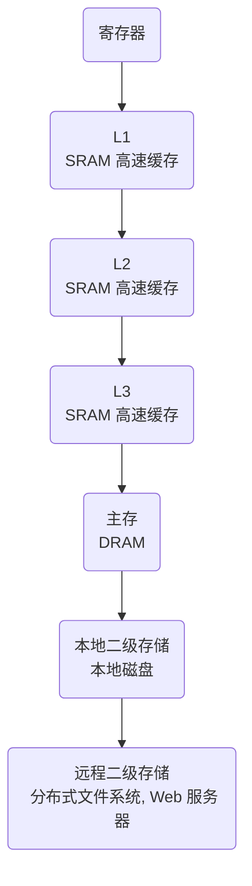

## csapp introduction

## Topic Index

>   这里是后续学习过程中，各章节对应的内容

1.   中央处理器，CPU，第 3 ~ 4 章
2.   主存，第 6 章
3.   进程，第 8 章
4.   虚拟内存，第 9 章
5.   文件，第 10 章
6.   线程，第 12 章

## C Language

>   C 语言的起源

贝尔实验室，1969 ~ 1973 创建，1989 发布 ANSI C 标准

国际标准化组织（International Standards Organization，ISO）定义了 C 语言以及一系列库函数，即所谓 C 标准库

C 一开始用于 Unix 系统开发，包括内核、程序编写

>   GNU，Linux，GCC

GNU，英文全称为 *GNU's Not Unix!*，GNU 是一个开源项目，包含很多用于调试和编写  Linux 系统的相关项目（包括 Kernel，debug 等）；可以理解为 GNU 是脚手架，而 Linux 是独立出去的内核项目，其的运作需要 GNU 脚手架，

GCC、GDB、EMACS 等，都是由 GNU 项目提供的工具集

>   程序的生命周期

编译系统：

以下是使用 `gcc -o hello hello.c` 所使用的编译系统


1.   预处理阶段，预处理器 cpp 将源码中的 `#include &lt;stdio.h&gt;` 等头文件插入到程序中，生成 hello.i 文件

2.   编译，编译器 ccl 将 hello.i 编写成汇编代码 hello.s 的形式

     ```assembly
     main:
     	push ebp
     	mov ebp, esp
     	push [unk_602010]
     	call puts
     	mov eax, 0
     	mov esp, ebp
     	pop ebp
     	ret
     ```

3.   汇编，汇编器 as 将 hello.s 翻译成机器语言 hello.o

4.   链接，链接器 ld 将 hello.o 结合其他的机器语言文件 printf.o 等内容链接起来，生成可执行文件 hello

## 硬件组成

>   计算机系统的硬件组成概览

计算机系统需要如下几个硬件设备组成

1.   总线

     总线是贯穿整个系统的抽象管道，它将携带信息字节于各个部件之间传递，总线所传递的内容单位是**字（word）**，

     字长是根据不同的系统架构而有所不同的，在 32 位架构下字长是 **1 Word = 4 Bytes = 32 bit**，在 64 位架构下是 **1 Word = 8 Bytes = 64 bit**

2.   I/O 设备

     最基础的 I/O 设备一般由以下部分组成：作为输入的键盘和鼠标、作为输出的显示屏、用于长期存储程序和数据的磁盘驱动器

     类似于总线的概念，各 I/0 设备共用一条很宽的 I/O 总线，I/0 设备逻辑如下图所示

     \!\[image-20230517090958538](E:\Pictures\markdown\image-20230517090958538.png)

3.   主存

     会在第 6 章具体介绍存储器技术

4.   处理器

     会在第 3 ~ 4 章详细介绍 CPU 是如何工作的

>   存储设备的层次结构

存储器层次结构大致分为七个等级，L0 为最高级，L6 为最低级；越高级空间越小、运行越快、造价越贵



## 操作系统

操作系统层介于 **应用层** 和 **硬件层** 之间，是一种软件；

程序在运行时，不能直接调用到计算机硬件，而是必须交由操作系统对硬件进行调配和使用

>   Unix，Posix 以及 Unix 规范

贝尔实验室，1973 年使用 C 重写 Unix 内核，1974 年对外发布；后续还发布了 System V Unix，

20 世纪 70 ~ 80 年代，美国加州大学伯克利分校为 Unix 发布版本添加了 虚拟内存 和 Internet 协议，称之为 *Unix 4. xBSD（Berkeley Software Distribution）*

今天的 Solaris 系统则是由这些初始的 BSD 和 System V 衍生而来；

Posix，是一种 Unix 开发标准化规范，涵盖诸如系统调用的 C 语言接口，shell 程序，网络编程等内容

>   进程，虚拟内存，文件，线程

会在第 8 章，第 9 章，第 10 章，第 12 章进入详细解析
