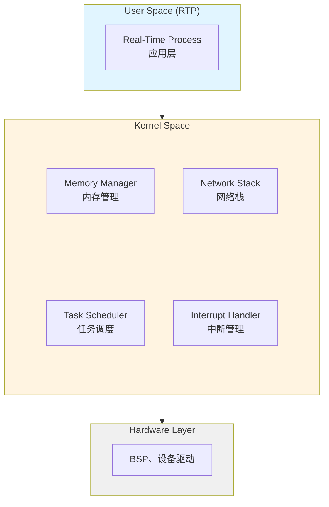

# RTOS

实时操作系统（Real-Time Operating System）

## VxWorks

Wind River 开发的 RTOS VxWorks，广泛用于航空航天、ICS、交换机、医疗等即时性要求很高的行业。优势是

-   确定性任务调度
-   模块化设计
-   架构支持丰富
-   安全更新及时
-   市场认可度高，行业标准需求

主要是三层架构：



1.   内核组件
     1.   Wind Kernel：任务、信号量、消息队列
     2.   VxBus：设备树
     3.   内存管理：虚拟内存、内存映射、内存保护
2.   网络栈
     1.   TCP / IP 协议栈
     2.   网络接口
     3.   网络服务：FTP、Telnet、HTTP
3.   文件系统：HRFS、dosFs（DOS 兼容）、NFS / CIFS（网络文件系统）
4.   应用层
     1.   RTP（Real-Time Process）：用户空间进程，独立地址空间
     2.   DKM（Downloadable Kernel Module）：内核模块，运行在内核空间

vxworks 通过系统调用接口的方式来使用，例如：

-   shell 接口，交互式命令行（`->` 提示符）
-   系统调用，函数调用，例如 `-> ifAddrAdd ("gei0", "192.168.100.10")`
-   符号表，通过 `lkup ("ifAddr")` 方式查看系统支持的符号 / 功能
-   c 编译器，直接编写 c 代码，实现功能测试

### run

通过 qemu 启用 vxworks 6.9，并展开测试

一般实际的 vxworks 系统跑在 powerpc、mips 上，这边可以通过 qemu 来仿真 `sudo apt install qemu-system-ppc`

下一步需要获取 vxworks 的 bootable 文件，通常是 `.bin` 文件或单个名为 vxWorks 的文件，这通常需要 wind river 的授权

有两种方式

-   （不支持内核裁剪，用于个人交流 / 学习、教育目的，使用 NCLA 非商业许可证）通过官方的 lab 获取 sdk
-   （更高级，支持内核裁剪）通过正式授权的 workbench 构建 vxworks 内核

#### 使用官方 sdk

路径：https://www.labs.windriver.com/vxworks-sdk/ -> https://forums.windriver.com/t/vxworks-software-development-kit-sdk/43 -> （更早版本的 vxworks）https://labs.windriver.com/downloads/wrsdk_prev.html

一些简单的名词解释：

-   BSP（Board Support Package），板级支持包，包含启动、外设驱动与平台配置，让操作系统在特定硬件上可启动、可用的 "板级适配层" 集合，可以看作是一个接口，它把内核与具体板卡/SoC 的启动、内存、中断、时钟、外设等对接起来
-   IA（Intel Architecture）
-   IA Generic / ITL Generic，面向通用 Intel PC 平台的 BSP，就理解为在 x86_64 PC 平台上常见的一种 BSP 即可，例如 itl_generic，这里的 ITL 大概就是 Intel 的缩写，在 vxworks 相关内容里见得比较多
-   SabreLite，NXP / Freescale i.MX6 SabreLite 开发板的 BSP 名称，通常是 ARM 架构

可惜的是这边最早只能下到 vxWorks 7.0 的版本，VxWorks 6.x 时代采用客户门户（订阅/维护合同）分发，介质和补丁仅对已签约客户开放，而且没有官方支持的 qemu sdk 一键包

下载 `wrsdk-vxworks7-qemu-1.15.1.tar.bz2` 后，相应的文件目录结构应该长这样

```bash
# 使用 7zip 来解压 bzip2 文件
$ 7z x wrsdk-vxworks7-qemu-1.15.1.tar.bz2
$ tar xvf wrsdk-vxworks7-qemu-1.15.1.tar
$ tree -L2                            
.
├── wrsdk-vxworks7-qemu
│   ├── commit.txt
│   ├── compilers
│   ├── docs
│   ├── examples
│   ├── NCLA.txt
│   ├── README.md
│   ├── sdkenv.sh
│   ├── sdk.json
│   ├── sdk.yml
│   ├── tools
│   └── vxsdk
├── wrsdk-vxworks7-qemu-1.15.1.tar
└── wrsdk-vxworks7-qemu-1.15.1.tar.bz2
```

为了让宿主机可以通过 ip 与 vxworks 通信，有两种方式：一种是通过 tap 网卡的方式实现，另一种是通过 qemu 端口转发。下面以第一种为主，这里设计宿主机的 ip 是 `192.168.100.1`，vxworks 的 ip 是 `192.168.100.10`

```bash
$ TAP_IF="tap0"; TAP_IP="192.168.100.1"; GUEST_IP="192.168.100.10"

$ sudo ip tuntap add mode tap user $USER name $TAP_IF
$ sudo ip addr add $TAP_IP/24 dev $TAP_IF
$ sudo ip link set $TAP_IF up
$ sudo sysctl -w net.ipv4.ip_forward=1 > /dev/null
$ sudo iptables -t nat -A POSTROUTING -s $GUEST_IP/24 -j MASQUERADE 2>/dev/null || true

# 最终如果需要清空 tap 网卡，可以用以下命令实现
$ sudo ip tuntap del mode $TAP_IF
```

可以简单地通过以下步骤启动一个 vxworks 系统，出现图标即为成功

```bash
# 使用 qemu 启动 vxworks 7
$ qemu-system-x86_64 \
    -m 1024 \
    -cpu qemu64 \
    -serial mon:stdio \
    -netdev tap,id=net0,ifname=$TAP_IF,script=no,downscript=no \
    -device e1000,netdev=net0,mac=52:54:00:12:34:56 \
    -kernel $KERNEL_PATH \
    -nographic

...
 
 _________            _________
 \........\          /......../
  \........\        /......../
   \........\      /......../
    \........\    /......../
     \........\   \......./
      \........\   \...../              VxWorks SMP 64-bit
       \........\   \.../
        \........\   \./     Release version: 25.03
         \........\   -      Build date: Apr 23 2025 10:57:59
          \........\
           \......./         Copyright Wind River Systems, Inc.
            \...../   -                 1984-2025
             \.../   /.\
              \./   /...\
               -   -------

                   Board: x86_64 Processor (ACPI_BOOT_OP) SMP/SMT
               CPU Count: 1
          OS Memory Size: ~958MB
        ED&R Policy Mode: Deployed
     Debug Agent: Started (always)
         Stop Mode Agent: Not started

...

-> version
VxWorks SMP 64-bit (for x86_64 Processor (ACPI_BOOT_OP) SMP/SMT)
Release version: 25.03
Build date: Apr 23 2025 10:57:59
Boot line:
gei(0,0)host:vxWorks h=192.168.200.254 e=192.168.200.2 u=target pw=vxTarget
value = 87 = 0x57 = 'W' = buffer + 0x17
-> 
```

手动配置 vxworks 的 ip，首先通过 lkup 函数查看系统内支持的操作

```bash
-> lkup("ifAddr")
ifAddrAdd                 0xffffffff80546fd0 text     
ifAddrSet                 0xffffffff80547440 text     
ifAddrDelete              0xffffffff80547210 text     
ifAddrGet                 0xffffffff80546f10 text     
value = 0 = 0x0

# 查看系统内启用的网卡名称，这里是 "gei0"
-> ifconfig
lo0     Link type:Local loopback
        inet 127.0.0.1  mask 255.255.255.255
        inet6 unicast fe80::1%lo0  prefixlen 64  automatic
        inet6 unicast ::1  prefixlen 128
        UP RUNNING LOOPBACK MULTICAST NOARP ALLMULTI 
        MTU:1500  metric:1  VR:0  ifindex:1
        RX packets:18 mcast:1 errors:0 dropped:0
        TX packets:18 mcast:1 errors:0
        collisions:0 unsupported proto:0
        RX bytes:1559  TX bytes:1559

gei0    Link type:Ethernet  HWaddr 52:54:00:12:34:56
        capabilities: VLAN_MTU VLAN_TXHWTAG VLAN_RXHWTAG 
        inet 192.168.200.2  mask 255.255.255.0  broadcast 192.168.200.255
        inet6 unicast fe80::5054:ff:fe12:3456%gei0  prefixlen 64  automatic
        UP RUNNING SIMPLEX BROADCAST MULTICAST 
        MTU:1500  metric:1  VR:0  ifindex:2
        RX packets:0 mcast:0 errors:0 dropped:0
        TX packets:5 mcast:4 errors:0
        collisions:0 unsupported proto:0
        RX bytes:0  TX bytes:370

value = 0 = 0x0

# 手动删除网卡中的 ip，再添加
-> ifAddrDelete("gei0", "192.168.200.2")
-> ifAddrSet("gei0", "192.168.100.10", "255.255.255.0")
```

可以用 nmap 来测试效果

```bash
$ nmap -sV -vvvv -p1-65535 192.168.100.10
Starting Nmap 7.95 ( https://nmap.org ) at 2025-11-04 10:04 +08
...
Scanning 192.168.100.10 (192.168.100.10) [65535 ports]
Discovered open port 23/tcp on 192.168.100.10
Discovered open port 111/tcp on 192.168.100.10
Discovered open port 1534/tcp on 192.168.100.10
Discovered open port 2345/tcp on 192.168.100.10
...
PORT     STATE SERVICE       REASON         VERSION
23/tcp   open  telnet        syn-ack ttl 64 HP Integrated Lights Out telnetd
111/tcp  open  rpcbind       syn-ack ttl 64 2 (RPC #100000)
1534/tcp open  micromuse-lm? syn-ack ttl 64
2345/tcp open  dbm?          syn-ack ttl 64
2 services unrecognized despite returning data.
```

#### 自制 bootable

这里假设你已经获取到了 vxworks 6.x 的 workbench，需要从 workbench 中构建 vxworks 启动所需文件

```bash
$ qemu-img create -f qcow2 vxworks.qcow2 1G
Formatting 'vxworks.qcow2', fmt=qcow2 cluster_size=65536 extended_l2=off compression_type=zlib size=1073741824 lazy_refcounts=off refcount_bits=16
```

### usage

```bash
-> help
help                           Print this list
dbgHelp                        Print debugger help info
edrHelp                        Print ED&R help info
ioHelp                         Print I/O utilities help info
nfsHelp                        Print nfs help info
netHelp                        Print network help info
rtpHelp                        Print process help info
spyHelp                        Print task histogrammer help info
timexHelp                      Print execution timer help info
h         [n]                  Print (or set) shell history
i         [task]               Summary of tasks' TCBs
ti        task                 Complete info on TCB for task
sp        adr,args...          Spawn a task, pri=100, opt=0x19, stk=20000
taskSpawn name,pri,opt,stk,adr,args... Spawn a task
tip       "dev=device1#tag=tagStr1", "dev=device2#tag=tagStr2", ...
                               Connect to one or multiple serial lines
td        task                 Delete a task
ts        task                 Suspend a task
tr        task                 Resume a task
tw        task                 Print pending task detailed info
w         [task]               Print pending task info
d         [adr[,nunits[,width]]] Display memory
m         adr[,width]          Modify memory
mRegs     [reg[,task]]         Modify a task's registers interactively
pc        [task]               Return task's program counter
iam       "user"[,"passwd"]    Set user name and passwd, possibly in
                               an interactive manner
whoami                         Print user name
devs                           List devices
ld        [syms[,noAbort][,"name"]] Load stdin, or file, into memory
                               (syms = add symbols to table:
                               -1 = none, 0 = globals, 1 = all)
lkup      ["substr"]           List symbols in system symbol table
lkAddr    address              List symbol table entries near address
checkStack  [task]             List task stack sizes and usage
printErrno  value              Print the name of a status value
period    secs,adr,args...     Spawn task to call function periodically
repeat    n,adr,args...        Spawn task to call function n times (0=forever)
version                        Print VxWorks version info, and boot line
shConfig  ["config"]           Display or set shell configuration variables
strFree   [address]            Free strings allocated within the shell (-1=all)

NOTE:  Arguments specifying 'task' can be either task ID or name.

value = 1 = 0x1

```

信息类：

```bash
-> help                       # 查看可用命令
-> version                    # 查看系统版本
-> memShow                    # 查看内存信息
-> taskShow                   # 查看任务列表
-> devs                       # 查看设备列表
-> ifShow                     # 查看网络接口
-> routeShow                  # 查看路由表
```

调试类

```bash
-> i						# 查看内存信息
-> ti		# task info

```


## sylix-os

隐形龙头翼辉及其产品 SylixOS

1. 介绍
2. 文章；https://docs.acoinfo.com/
3. 环境搭建
4. 开源社区
5. 应用

## FreeRTOS


## QNX


## RT-Thread