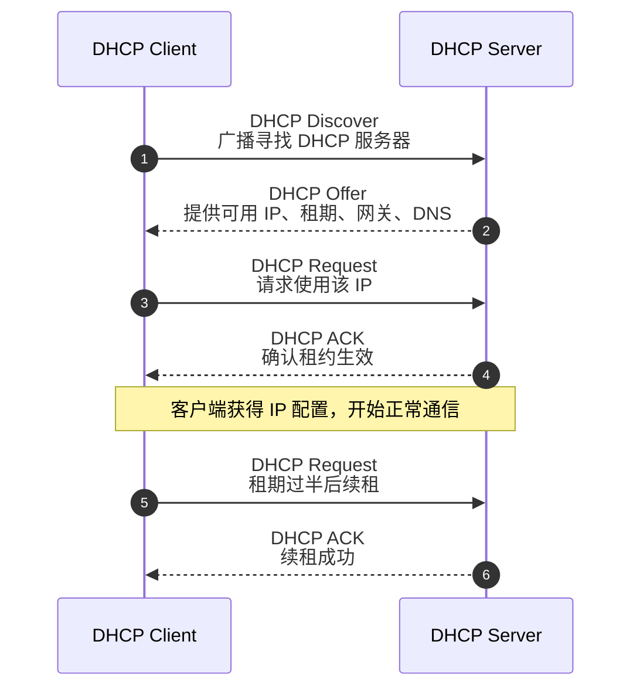

# handle a dhcp promblem with tshark

在网关 192.168.9.1 里，为我的 linux 设备 enp2s0 mac 绑定静态 ip 后，发现 linux 端无论如何也没法拿到想要的 ip；然而在网关 dhcp 已分配租约里，没有看到该 ip 被分配的迹象

通过 tcpdump（wireshark）抓取以太网卡的启动协商过程流量

```bash
$ sudo tcpdump -i enp2s0 -w dhcp.pcapng
tcpdump: listening on enp2s0, link-type EN10MB (Ethernet), snapshot length 262144 bytes
^C2577 packets captured
2661 packets received by filter
0 packets dropped by kernel
```

用 tshark 查看流量信息；（通过 tshark + tcpdump 的方式抓取流量，很方便文字化处理识别和处理网络流量）

```bash
$ tshark -r ./dhcp.pcapng -Y dhcp 
  157 8.475899916      0.0.0.0 → 255.255.255.255 DHCP 338 DHCP Request  - Transaction ID 0x34d6391f
  158 8.477024201  192.168.9.1 → 255.255.255.255 DHCP 342 DHCP NAK      - Transaction ID 0x34d6391f
  159 8.497449215      0.0.0.0 → 255.255.255.255 DHCP 338 DHCP Discover - Transaction ID 0x4370788a
  160 8.498495301  192.168.9.1 → 192.168.9.4  DHCP 353 DHCP Offer    - Transaction ID 0x4370788a
  161 8.498560595      0.0.0.0 → 255.255.255.255 DHCP 344 DHCP Request  - Transaction ID 0x4370788a
  162 8.499676944  192.168.9.1 → 192.168.9.4  DHCP 353 DHCP ACK      - Transaction ID 0x4370788a
  167 8.552044228      0.0.0.0 → 255.255.255.255 DHCP 320 DHCP Decline  - Transaction ID 0x5b658366
  203 18.552119006      0.0.0.0 → 255.255.255.255 DHCP 338 DHCP Discover - Transaction ID 0x15ece663
  236 20.652186950      0.0.0.0 → 255.255.255.255 DHCP 338 DHCP Discover - Transaction ID 0x3a02ceda
  243 21.625037687  192.168.9.1 → 192.168.9.141 DHCP 353 DHCP Offer    - Transaction ID 0x15ece663
  244 21.625421332  192.168.9.1 → 192.168.9.141 DHCP 353 DHCP Offer    - Transaction ID 0x3a02ceda
  245 21.625454565      0.0.0.0 → 255.255.255.255 DHCP 344 DHCP Request  - Transaction ID 0x3a02ceda
  246 21.626577777  192.168.9.1 → 192.168.9.141 DHCP 353 DHCP ACK      - Transaction ID 0x3a02ceda
```

162 号包之前是一次正常的 dhcp request 和 offer 的过程，但是在 167 号包里，host 主动 decline 了这个 offer

参看 dhcp delivery 的流程如图所示，很明显预期的 dhcp delivery 流程卡在了第 3 步



筛选一下 152 - 203 之间的相关流量

```bash
$ tshark -r ./dhcp.pcapng -Y "frame.number >= 157 and frame.number <= 203 and not tcp and not icmpv6 and not dhcpv6 and not mdns"
  157 8.475899916      0.0.0.0 → 255.255.255.255 DHCP 338 DHCP Request  - Transaction ID 0x34d6391f
  158 8.477024201  192.168.9.1 → 255.255.255.255 DHCP 342 DHCP NAK      - Transaction ID 0x34d6391f
  159 8.497449215      0.0.0.0 → 255.255.255.255 DHCP 338 DHCP Discover - Transaction ID 0x4370788a
  160 8.498495301  192.168.9.1 → 192.168.9.4  DHCP 353 DHCP Offer    - Transaction ID 0x4370788a
  161 8.498560595      0.0.0.0 → 255.255.255.255 DHCP 344 DHCP Request  - Transaction ID 0x4370788a
  162 8.499676944  192.168.9.1 → 192.168.9.4  DHCP 353 DHCP ACK      - Transaction ID 0x4370788a
  165 8.512946009 AIstoneGloba_69:b3:2a → Broadcast    ARP 42 Who has 192.168.9.4? (ARP Probe)
  166 8.513931421 HonHaiPrecis_5c:62:05 → AIstoneGloba_69:b3:2a ARP 60 192.168.9.4 is at f4:6b:8c:5c:62:05
  167 8.552044228      0.0.0.0 → 255.255.255.255 DHCP 320 DHCP Decline  - Transaction ID 0x5b658366
  168 8.711024744 AIstoneGloba_69:b3:2a → Broadcast    ARP 42 Who has 192.168.9.4? (ARP Probe)
  169 8.712026918 HonHaiPrecis_5c:62:05 → AIstoneGloba_69:b3:2a ARP 60 192.168.9.4 is at f4:6b:8c:5c:62:05
  181 10.704365498 AIstoneGloba_69:b3:2a → Broadcast    ARP 42 Who has 192.168.9.4? (ARP Probe)
  182 10.705342544 HonHaiPrecis_5c:62:05 → AIstoneGloba_69:b3:2a ARP 60 192.168.9.4 is at f4:6b:8c:5c:62:05
  194 13.551453816 00:e2:69:1e:92:34 → AIstoneGloba_69:b3:2a ARP 60 Who has 192.168.9.4? Tell 192.168.9.1
  196 14.591471329 00:e2:69:1e:92:34 → AIstoneGloba_69:b3:2a ARP 60 Who has 192.168.9.4? Tell 192.168.9.1
  201 15.631486687 00:e2:69:1e:92:34 → AIstoneGloba_69:b3:2a ARP 60 Who has 192.168.9.4? Tell 192.168.9.1
  203 18.552119006      0.0.0.0 → 255.255.255.255 DHCP 338 DHCP Discover - Transaction ID 0x15ece663

```

答案很明显了，host 在 162 号报文获得了 `192.168.9.4` 的 offer，但是又在 165、166 号报文中，通过 arp 发现链路上已有 mac 地址声明了这个 ip，因此拒绝了网关 dhcp 的 offer

通过排查发现 windows 主机关机了，但是网卡没下电，一直占用该 ip，手动插拔网线就 release 掉了
